<!-- 
To Do: 
    move mathjax to document bottom (pandoc_html())
    copy math TeX command button (JS)
        1. extract plain text from .math.display
        2. save to some element
        3. add a copy button
 -->

:::: {.body}

::: {.side .side-right}
This site is built with Yihui's [*simple HTML article*](https://yihui.org/en/2023/10/html-article/) format.
:::

[liao961120/snippets](https://github.com/liao961120/snippets) holds the TeX snippets I've used to code equations and TikZ graphs. To search the content inside the `.tex` files contained in this repo, run:

```bash
bash search.sh SEARCH_TERM
```

To update `README.md` (i.e., build [Gallery](#gallery)), run:

```bash
Rscript build.R
# Rscript build.R --full  # rebuild all img from pdf
```

To edit LaTeX equations that get rendered with mathjax, edit `eq.md`.
::::


Textbook Equations
------------------

### Taylor series

:::: {.side .side-right}
Click on &nbsp;[]{.copy-button style="float:initial;display:inline-block"} 
to copy the equation's TeX commands.
::::

$$
f(x) = \sum _{n=0}^{\infty }{\frac {f^{(n)}(a)}{n!}}(x-a)^{n} 
     = f(a)+{\frac {f'(a)}{1!}}(x-a)+{\frac {f''(a)}{2!}}(x-a)^{2}+{\frac {f'''(a)}{3!}}(x-a)^{3}+\cdots
$$


Personal Snippets
-----------------

### Martrix Multiplication

$$
\begin{bmatrix}
    1 & 0 \\
    0 & 1 \\
    -1 & -1
    \end{bmatrix} 
    \begin{bmatrix}
    E_1 \\
    E_2
    \end{bmatrix} = 
    \begin{bmatrix}
    E_1 \\
    E_2 \\
    -E_1 - E_2
\end{bmatrix}
$$


### Annotating Matrices

$$
\mathop{
   \begin{bmatrix}
   1 & 0 \\
   0 & 1 \\
   -1 & -1
   \end{bmatrix}
}_{ Contrast } 
\mathop{
   \begin{bmatrix}
   \sigma_{1}^{2} & \sigma_{1 2} \\
   \sigma_{2 1} & \sigma_{2}^{2} 
   \end{bmatrix}
}_{ \substack{\phantom{S} \\ Covariance\\ Matrix } } 
\mathop{
   \begin{bmatrix}
   1 & 0 & -1 \\
   0 & 1 & -1
   \end{bmatrix}
}_{  \substack{\phantom{s} \\ Contrast^T} } 
=
\mathop{
   \begin{bmatrix}
   \sigma_{1}^{2}                 & \sigma_{1 2}                     & -\sigma_{1}^{2} - \sigma_{1 2} \\
   \sigma_{2 1}                   & \sigma_{2}^{2}                   & -\sigma_{2}^{2} - \sigma_{2 1} \\
   -\sigma_{1}^{2} - \sigma_{2 1} & -\sigma_{2}^{2} - \sigma_{1 2} & \sigma_{1}^{2} + \sigma_{2}^{2} + \sigma_{1 2} + \sigma_{2 1}
   \end{bmatrix}
}_{ \substack{ Covariance~Matrix ~ (Reconstructed) } } 
$$


### A Bayesian Model

$$
\begin{aligned} 
    & \hphantom{xxxxxx} \textbf{Process Model} \\
    &\begin{cases}
        P_{t + \Delta t} = P_t + r P_t (1 - \frac{P_t}{K}) \Delta t \\
        P_\text{t=0}  ~~ = P_0 \\
    \end{cases} 
    \\
    &\begin{bmatrix}
        N_1 \\
        N_2 \\
        \vdots \\
        N_T
    \end{bmatrix} \sim \text{MVNormal}( 
        \begin{bmatrix}
            0 \\
            0 \\
            \vdots \\
            0
        \end{bmatrix}, 
    \textbf{K} ) 
    \\
    & ~~~ k_{i,j} = \eta ~ \text{exp}( -\rho \text{d}^\text{2}_{i,j} ) \\
    \end{aligned}
$$


$$
\begin{aligned}
    & \hphantom{xxxx} \textbf{Measurement Model} \\
    & \hphantom{xxxxx} \mathrm{ P_{t}^{obs} }  \sim \text{Normal}( M_t, \sigma )  \\
    & \hphantom{xx} M_t                     =  b ~ \left[ a P_t - \left( 1 - a \right) N_t \right] - c 
\end{aligned}
$$


<!-- GALLERY -->
<!-- The content below is autogenerated, edit build.R instead. -->

Gallery
-------

### Graphs

#### [`dag-feedback-dyn.tex`](https://github.com/liao961120/snippets/tree/main/tikz/dag-feedback-dyn.tex)
   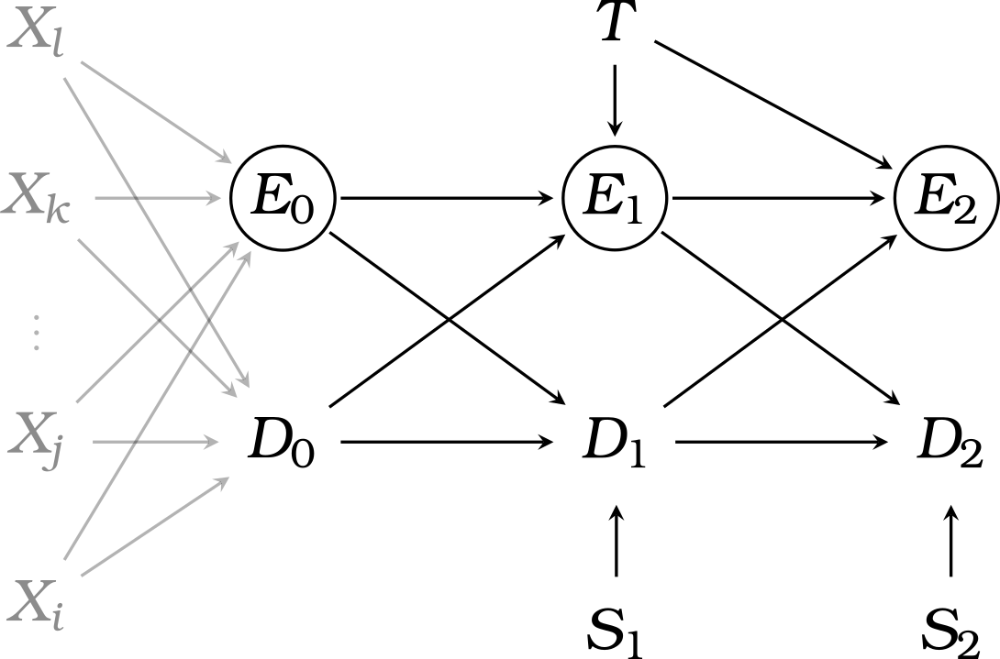

#### [`dag-intra.tex`](https://github.com/liao961120/snippets/tree/main/tikz/dag-intra.tex)
   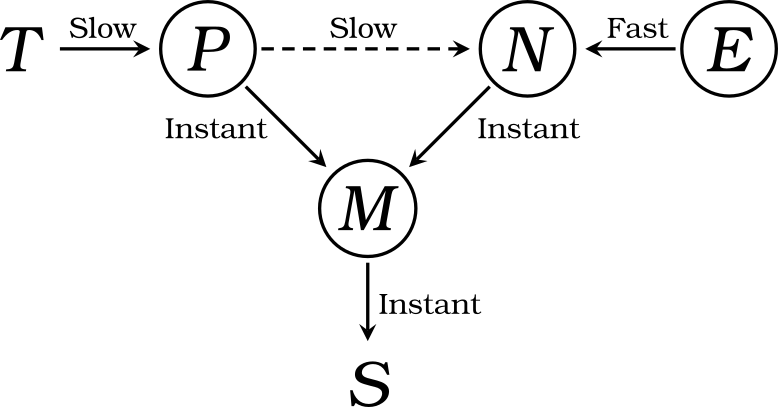

#### [`tree0.tex`](https://github.com/liao961120/snippets/tree/main/tikz/tree0.tex)
   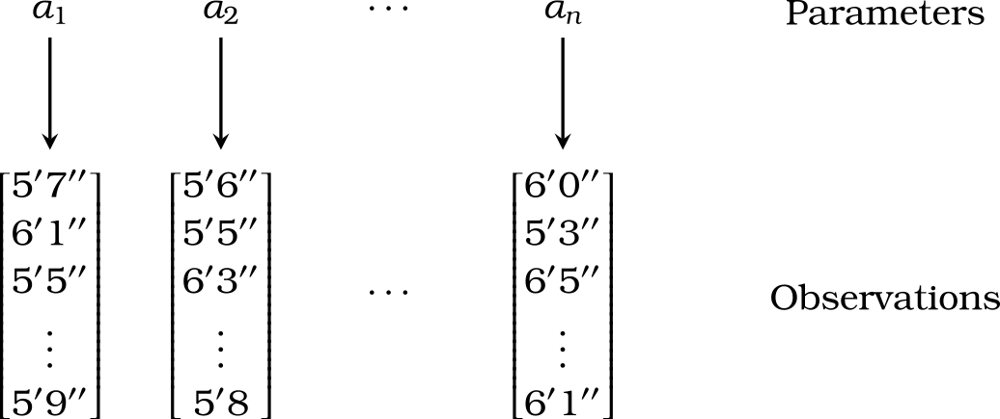

#### [`tree1.tex`](https://github.com/liao961120/snippets/tree/main/tikz/tree1.tex)
   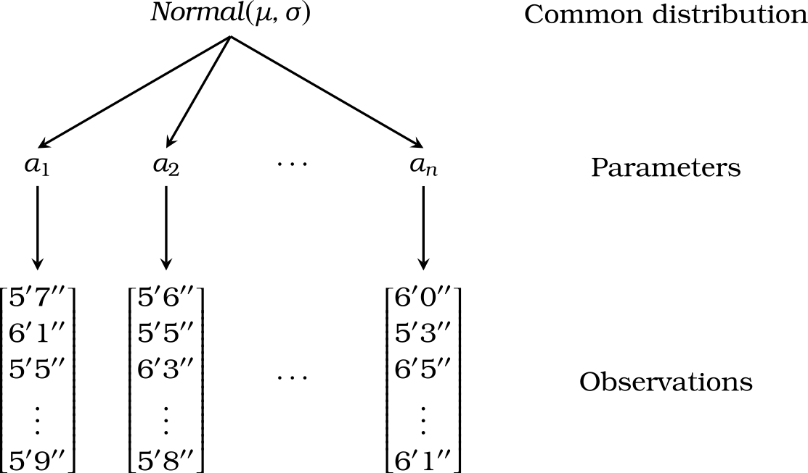

### Equations

#### [`bottom-annotation.tex`](https://github.com/liao961120/snippets/tree/main/eq/bottom-annotation.tex)
   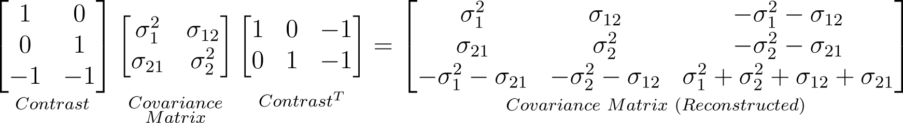

#### [`equations-intra.tex`](https://github.com/liao961120/snippets/tree/main/eq/equations-intra.tex)
   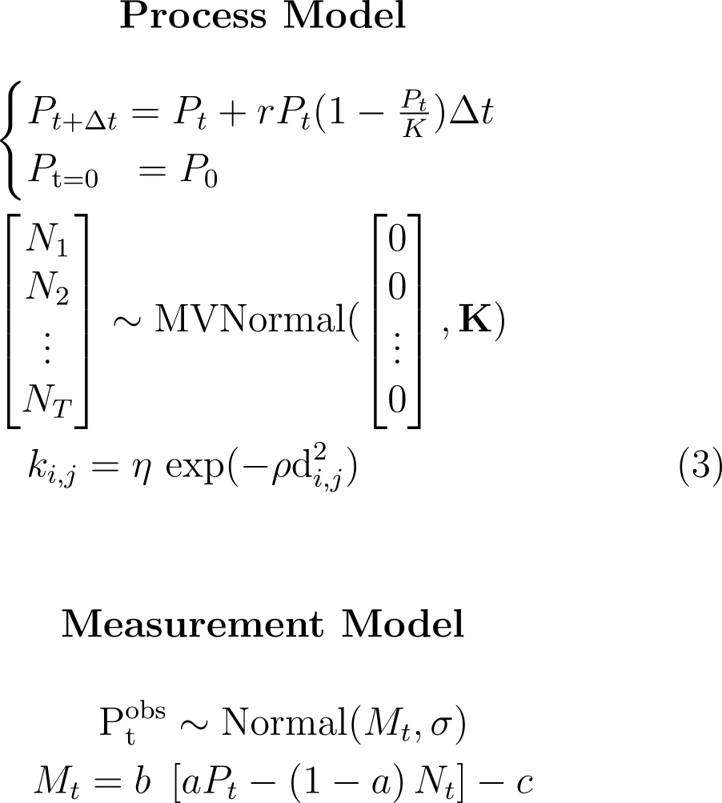

#### [`intra2.tex`](https://github.com/liao961120/snippets/tree/main/eq/intra2.tex)
   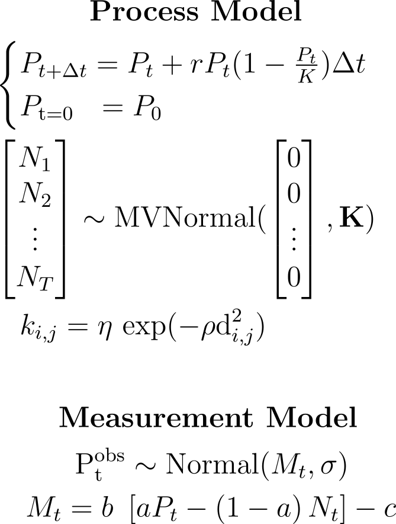

#### [`matrix-multiplication.tex`](https://github.com/liao961120/snippets/tree/main/eq/matrix-multiplication.tex)
   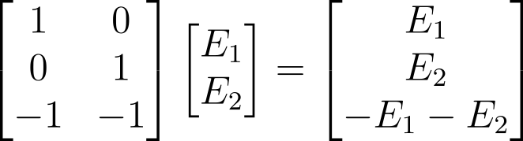

#### [`model-formulation.tex`](https://github.com/liao961120/snippets/tree/main/eq/model-formulation.tex)
   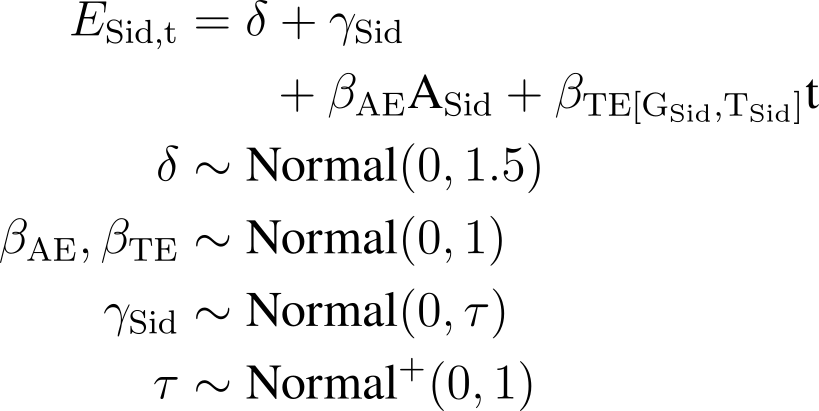
   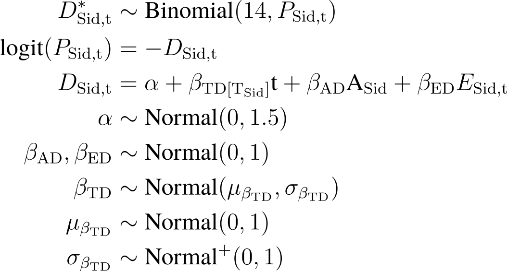
   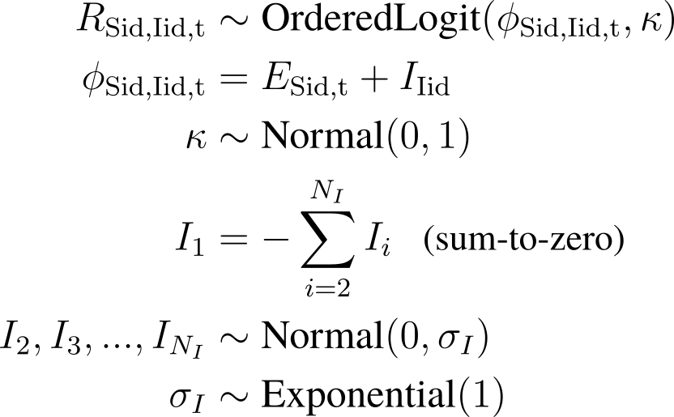
